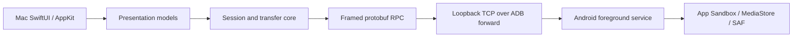

# DroidMatch

[English developer guide](docs/developer-onboarding.md) ·
[文档索引](docs/README.md) ·
[贡献指南](CONTRIBUTING.md) ·
[安全政策](SECURITY.md)

DroidMatch 是一款本地优先的 macOS Android 设备管理器。它通过 USB/ADB 连接 Mac
原生 App 与 Android 安全 companion，提供配对认证、权限管理、文件与媒体浏览，以及
可恢复的双向传输。

> **当前状态：M1 收口期。** 产品主路径已经可构建和验证，但还不是面向普通用户的正式
> 分发版本。Slot C 产品认证/传输已有归档真机证据；剩余 ADB M1 阻塞项是 Slot A
> current-tip release 吞吐证据，以及 Slot A/C/D 的产品 USB 插入时延证据。Developer ID
> 签名、公证和正式发布自动化按当前决定暂缓。

## 为什么是 DroidMatch

- **本地优先**：USB 优先，默认不依赖云账号、远程中继或第三方设备管理服务。
- **双端原生**：Mac 使用 SwiftUI/AppKit，Android 使用平台原生服务、权限和存储 API。
- **显式信任**：首次配对显示 SAS，重连要求已配对凭据证明；Android 权限始终按实时
  状态判断。
- **可靠传输**：支持 CRC32、原子下载、暂停、取消、重试和带稳定 source fingerprint
  的断点续传。
- **隐私受限诊断**：产品展示和支持报告不暴露 ADB serial、凭据、私有路径或原始平台
  异常。
- **清晰边界**：产品 UI、会话、RPC、传输和 Android provider 各自拥有明确职责。

DroidMatch 借鉴 HandShaker 中有价值的工作流，但不复用其品牌、代码、二进制、签名材料
或 UI 资产。边界说明见[与 HandShaker 的关系](docs/handshaker-relationship.md)。

## 当前能力

- Mac 端异步、serial 脱敏的 ADB 发现，动态 loopback forward，以及可见 SAS 配对和已配对重连。
- 认证后的文件浏览：分页、搜索、排序、新建文件夹、重命名、删除、多选和原生右键
  操作。
- 独立媒体中心：照片、相册、视频列表/网格、缩略图、静态预览和实时权限重新检查。
- 原生文件面板与 Finder 拖放上传，以及多文件下载；任务进入按认证设备隔离的持久
  队列。
- App Sandbox、MediaStore 和 SAF provider；能力与当前授权共同决定可读、可写和可恢复行为。
- 暂停、继续、取消、重试、恢复和隐私受限的传输状态/系统通知。
- 中英文 Mac 产品界面、Android 安全连接/权限入口、本地帮助和结构化诊断导出。
- 本地 ad-hoc `.app` 与 sandbox DMG 的可重复组装和挂载验证。

能力边界、证据和未完成项以 [M1 状态总览](docs/m1-status.md) 为准。fixture 只证明对应
commit 上发生过的运行，不替代当前状态文档。

## 构建与验证

需要 macOS 13+、Xcode/Swift、JDK 17、Android SDK Platform 36、Build Tools 36.0.0、
ADB，以及 Protocol Buffers 工具链。先检查本地环境：

```bash
bash tools/check-env.sh --all
```

构建并打开 Mac 产品 App：

```bash
tools/build-mac-app.sh
open mac/.build/app/DroidMatch.app
```

运行 Mac 测试：

```bash
bash tools/run-swift-tests.sh
```

构建并检查 Android App：

```bash
cd android
./gradlew --no-daemon :app:testDebugUnitTest :app:assembleDebug :app:lintDebug
```

运行完整的本地跨端门禁：

```bash
bash tools/check-m1-skeleton.sh
```

真机脚本可能安装 APK、创建测试文件或临时修改权限。只有在明确选定可写测试设备并制定
清理计划后，才按照 [M1 真机测试指南](docs/m1-testing-guide.md)运行；不要把设备仅仅连接到
ADB 视为写入授权。

## 架构概览



- UI 只依赖 domain/session/transfer 接口，不解析 protobuf，也不执行原始 ADB 命令。
- Mac transport 负责字节和连接；RPC 负责 envelope、ID 和响应匹配；transfer 负责恢复与提交。
- Android dispatcher 负责协议路由，存储和权限规则留在 provider 边界内。
- `proto/v1/*.proto` 是跨端 wire schema 的唯一事实源。

完整职责图见[架构](docs/architecture.md)，wire 行为见[协议](docs/protocol.md)和
[协议运行时](docs/protocol-runtime.md)，信任边界见[安全模型](docs/security-model.md)。

## 仓库结构

```text
DroidMatch/
├── mac/               # Swift package、Mac 产品 App、Core 与 harness
├── android/           # Android companion、RPC dispatcher 与 providers
├── proto/v1/          # 跨端 protobuf schema
├── docs/              # 当前事实、设计、开发、测试与维护文档
├── tools/             # 环境检查、生成、构建、门禁与真机 runner
├── fixtures/          # 脱敏测试数据和版本化真机证据
└── .github/workflows/ # 托管 CI
```

## 文档导航

完整地图和“哪份文档是当前事实”的说明见 [docs/README.md](docs/README.md)。常用入口：

| 目的 | 文档 |
|---|---|
| 了解当前能力、缺口和证据 | [M1 状态总览](docs/m1-status.md) |
| 搭建开发环境 | [开发者入门](docs/developer-onboarding.md) · [中文](docs/developer-onboarding-zh.md) |
| 理解系统与代码边界 | [架构](docs/architecture.md) · [Mac](docs/mac-code-overview.md) · [Android](docs/android-code-overview.md) |
| 修改协议、路径或认证 | [协议](docs/protocol.md) · [路径模型](docs/path-model.md) · [配对认证](docs/pairing-auth-design.md) |
| 运行本地或真机测试 | [CI/CD](docs/ci-cd.md) · [M1 测试指南](docs/m1-testing-guide.md) |
| 维护、交接或判断发布 | [维护者手册](docs/maintainer-runbook.md) · [GitHub 治理](docs/github-governance.md) |

## 参与开发

修改前请阅读 [CONTRIBUTING.md](CONTRIBUTING.md) 和 [AGENTS.md](AGENTS.md)。重要约束：

- 行为变化必须同步更新对应的当前文档和测试。
- 不手改生成的 Swift protobuf 文件。
- 不把本地测试、历史 fixture 或自动化审查描述成新的真机证据或独立人工批准。
- 不读取、提交或输出设备 serial、用户路径、凭据、签名材料或未脱敏日志。

安全问题请按 [SECURITY.md](SECURITY.md) 私下报告，不要在公开 issue 中附带敏感材料。

## 许可

DroidMatch 使用 [Mozilla Public License 2.0](LICENSE) 授权。
