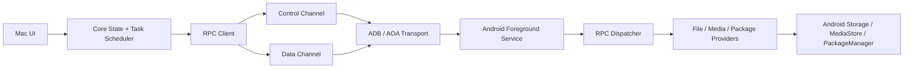

# Architecture

## Principles

- Separate product UI from transport and protocol.
- Keep control-plane requests responsive while data-plane transfers run.
- Treat Android permissions as dynamic state, not setup-time assumptions.
- Make every connection failure diagnosable.
- Keep legacy compatibility isolated behind adapters.

## Repository

```text
DroidMatch/
├── mac/
├── android/
├── proto/
├── docs/
├── tools/
├── fixtures/
└── .github/workflows/
```

## Mac Modules

```text
mac/
├── App/                 # SwiftUI/AppKit UI
├── Core/                # State machine, task scheduler, domain models
├── Transport/           # ADB, AOA, legacy adapter
├── Protocol/            # Protobuf, framing, errors
├── Media/               # Thumbnails, preview, range streaming
├── Diagnostics/         # Logs, support bundles, counters
└── Tests/
```

Primary interfaces:

- `DeviceDiscovery`
- `DeviceSession`
- `Transport`
- `RpcClient`
- `FileProvider`
- `MediaProvider`
- `TransferScheduler`
- `DiagnosticsCollector`

M0 interface boundaries:

- `DeviceDiscovery` owns device visibility events and transport candidates.
- `DeviceSession` owns connection state, selected transport, negotiated capabilities, and reconnect policy.
- `Transport` owns byte movement, state transitions, teardown, and transport-level counters.
- `RpcClient` owns request IDs, response matching, protocol errors, and control/data-plane routing.
- `FileProvider` and `MediaProvider` expose domain operations only; they do not know whether ADB, AOA, or a legacy adapter is carrying bytes.
- `TransferScheduler` owns queueing, pause/cancel/retry/resume decisions, and transfer metadata.
- `DiagnosticsCollector` owns Mac-side support bundles and merges transport, protocol, permission, and transfer data.

## Android Modules

```text
android/
├── app/
├── service/
├── transport/
├── protocol/
├── providers/
├── permissions/
├── diagnostics/
└── tests/
```

Primary components:

- `ForegroundConnectionService`
- `AdbForwardTransport`
- `AoaAccessoryTransport`
- `RpcDispatcher`
- `FileProvider`
- `MediaStoreProvider`
- `PackageProvider`
- `PermissionStateProvider`
- `DiagnosticsReporter`

M0 component boundaries:

- `ForegroundConnectionService` owns service lifetime, notification visibility, and transport binding.
- `AdbForwardTransport` owns the TCP endpoint used through `adb forward`.
- `AoaAccessoryTransport` owns accessory permission, endpoint opening, and bulk I/O.
- `RpcDispatcher` owns request dispatch, response framing, cancellation lookup, and error normalization.
- `FileProvider`, `MediaStoreProvider`, and `PackageProvider` own Android API access and permission-aware degradation.
- `PermissionStateProvider` owns live capability reporting.
- `DiagnosticsReporter` owns Android-side logs, counters, and service state snapshots.

## Data Flow



## Diagnostics Ownership

- Transport modules emit state transitions, reconnect attempts, endpoint details, and throughput counters.
- Protocol modules emit request IDs, payload types, negotiated versions, error codes, and timeout/cancel events.
- Provider modules emit permission state, degraded capabilities, read-only paths, and Android API failures.
- Mac `DiagnosticsCollector` creates the user-exportable support bundle.
- Android `DiagnosticsReporter` supplies service state, permission state, recent provider errors, and transport counters.

## Cache Ownership

- The Mac app owns persistent caches for thumbnails, media index summaries, transfer metadata, and support bundle staging.
- The Android app owns only short-lived in-process caches for provider queries and chunk reads.
- Cache keys must include device identity, protocol major version, provider root, and permission snapshot.
- Mutations invalidate affected directory and media cache entries.
- Permission changes invalidate provider and media caches for the affected capability.
- Transport changes do not invalidate content caches unless the device identity or protocol version changes.
- v1.0 has no cloud cache and no cache shared across devices.
