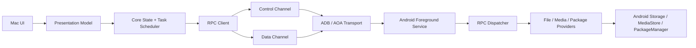

# Architecture

## Principles

- Separate product UI from transport and protocol.
- Keep control-plane requests responsive while data-plane transfers run.
- Treat Android permissions as dynamic state, not setup-time assumptions.
- Make every connection failure diagnosable.
- Keep legacy compatibility isolated behind adapters.

## Repository

```text
DroidMatch/
├── mac/
├── android/
├── proto/
├── docs/
├── tools/
├── fixtures/
└── .github/workflows/
```

## Mac Modules

```text
mac/
├── App/                 # SwiftUI/AppKit UI
├── Core/                # State machine, task scheduler, domain models
├── Transport/           # ADB, AOA, legacy adapter
├── Protocol/            # Protobuf, framing, errors
├── Media/               # Thumbnails, preview, range streaming
├── Diagnostics/         # Logs, support bundles, counters
└── Tests/
```

Primary interfaces:

- `DeviceDiscovery`
- `DeviceSession`
- `Transport`
- `RpcClient`
- `FileProvider`
- `MediaProvider`
- `TransferScheduler`
- `DiagnosticsCollector`

M0 interface boundaries:

- `DeviceDiscovery` owns device visibility events and transport candidates.
- `DeviceSession` owns connection state, selected transport, negotiated capabilities, and reconnect policy.
- `Transport` owns byte movement, state transitions, teardown, and transport-level counters.
- `RpcClient` owns request IDs, response matching, protocol errors, and control/data-plane routing.
- `FileProvider` and `MediaProvider` expose domain operations only; they do not know whether ADB, AOA, or a legacy adapter is carrying bytes.
- `TransferScheduler` owns queueing, pause/cancel/retry/resume decisions, transfer metadata, and the optional durable queue manifest.
- `DroidMatchPresentation` owns MainActor observation and privacy-bounded native view state; it never parses protocol messages, performs file I/O, or invents transfer/wire behavior.
- `DiagnosticsCollector` owns Mac-side support bundles and merges transport, protocol, permission, and transfer data.
- All product and CLI transport APIs are async and cancellation-aware. The former synchronous adapter has been deleted; App/MainActor and evidence code enter through `AsyncFramedTcpSession` or a higher async abstraction.
- `AdbDeviceDiscovery` is the concrete product `DeviceDiscovery` and ADB-forward lease boundary. It executes bounded blocking ADB commands on a private queue, retains serials only in a Core actor, emits process-local opaque UUIDs, creates dynamic loopback forwards by opaque device ID, and removes the exact owned forward on cancellation/failure/disconnect. `DeviceDiscoveryModel` atomically replaces successful snapshots, marks retained data stale after failure, and rejects late refresh generations.
- `ProductDeviceSessionContracts` owns only stable product values, protocols, and concrete client conformances; `ProductDeviceSessionCoordinator` owns one forward lease plus at most one pairing or authenticated RPC client. Immutable `ProductTransferSchedulerAssembly` reloads the exact fingerprint-bound Keychain record before deriving the local-access owner, persistence store, invalidatable retry gate, and access-leased download/upload executors; it owns no generation, build task, live scheduler, or teardown decision. `ProductTransferPersistenceLocation` owns only the private manifest's domain-separated route and one-way legacy location migration: the new name never embeds the raw fingerprint, same-directory `RENAME_EXCL` prevents overwrite, and a current/legacy collision, symlink, or non-regular node is preserved and rejected. The actor-confined `ProductTransferSchedulerLifecycle` value atomically owns the current retry gate, published scheduler, and generation-bound single-flight build: concurrent callers share one build, the gate and scheduler become teardown-visible before activation, and cleanup can clear resources only when its build ID and object identity still match. The coordinator remains the sole validator of authentication generation and the sole caller of asynchronous cleanup. `ProductDeviceSessionResources` receives only an atomically detached generation and preserves the audited build-cancel → gate-invalidate → keepalive-cancel → scheduler-suspend → clients-close → forward-release order without retaining or mutating live coordinator state; it also owns the invalidatable transfer-client gate captured by retry coordinators. A Hello-only fresh connection supplies an untrusted identity selector; exact Keychain metadata chooses the pairing ID/key, and a second fresh connection must prove that key before capabilities are accepted. First pairing instead uses the visible SAS approval flow. A 10-second heartbeat owns product-session liveness: timeout, transport/remote failure, or echo mismatch first detaches the current generation, releases it in that order, then a session-scoped buffered event maps only the current Presentation generation to stable `connectionUnavailable`. Explicit disconnect/replacement cleanly finishes the old observer. Generation checks and deterministic teardown reject stale actor re-entry and keep sockets, ports, serials, credentials, and raw errors below `DeviceSessionModel`.
- `ProductDeviceDiagnosticsCodec` is the only product mapping for Android device-info/diagnostics. It omits device ID and raw event/error strings, accepts only three named permission fields and a fixed counter allowlist, normalizes service state, validates numeric ranges, and strips control characters from bounded optional display metadata. `DeviceDiagnosticsModel` owns refresh/stale state; SwiftUI never renders diagnostics protobufs or arbitrary key/value pairs.
- Swift actors are re-entrant at suspension points. Each async TCP connection therefore selects one I/O mode for its lifetime: legacy FIFO round trips, or multiplexed I/O owned by one RPC router. Multiplexed mode serializes writes but has exactly one independent reader that routes response/error frames by request ID and transfer frames by request/stream ID; competing readers and mode mixing are rejected.
- Download stream parsing and checksum/offset/window validation produce an immutable value in `AsyncRpcTransferValidation`; only the multiplexer actor applies that value to route state, yields it to the bounded consumer queue, and updates the route table. That actor-isolated inbound application is grouped in `AsyncRpcMultiplexerInboundRouting.swift` without copying state or owning another reader/socket. The pure helper owns no task, waiter, socket, or queue mutation.
- Product async uploads use a deterministic bounded-window operation: validate the full batch, emit at most 4 chunks / 2 MiB in offset order, then correlate ordered ACKs. Protocol cancellation is transfer-local after remote confirmation; direct task cancellation after a frame is admitted closes the ambiguous connection.
- `AsyncUploadFileSender` is the single file-to-window pump shared by recovery coordination and the isolated mixed-direction smoke. `AsyncMixedTransferSmokeClient` opens both directions, requires heartbeat while download is still unacknowledged and upload has sent no chunk, then runs atomic receive and upload refill concurrently. It owns the evidence session through teardown and uses an opaque inactive-side upload source label so local paths never become remote diagnostics.
- Product async downloads keep file ownership below the scheduler/UI boundary: a transfer handle serializes chunk → partial write → ACK, performs blocking file calls on a private serial queue, and atomically replaces the destination only after final ACK. The scheduler owns sidecar/retry policy and must open with the inspected partial offset plus source fingerprint; the receiver validates the accepted offset again before writing.
- The product queue is an actor above the download/upload coordinators: it owns FIFO admission, a default two-job concurrency cap, observable lifecycle snapshots, completion waiting, cancellation, and checkpoint pause/resume. Snapshot progress is a monotonic absolute receiver-confirmed checkpoint (download write + ACK; upload ACK + resumable sidecar commit), never a count of merely emitted bytes. Queued pause is a hold; running pause is allowed only after a durable checkpoint and before completion for downloads and resume-capable app-sandbox/SAF uploads. It cancels that coordinator's exclusive session, preserves the partial/sidecar, and requeues the same logical job at the FIFO tail with an explicit resume request; it is not the download-only wire pause message. A local two-second time-weighted estimator uses monotonic uptime, resets per retry/pause, publishes nil when a running sample expires, and freezes any still-valid sample on terminal transition; it does not enable protocol progress events. `canRemove` stays false while a cancelled task is still unwinding. The ordinary initializer is process-local; an explicit `TransferQueuePersistenceStore` plus `restoring(...)` enables a versioned atomic manifest. Executor start is write-ahead gated. Only an active download or app-sandbox/SAF upload with a matching valid sidecar becomes paused/resumable after reconstruction; stale, corrupt, missing-checkpoint, and fresh-only MediaStore work becomes persistent `interrupted` state and is never replayed automatically. Manifest paths are private local recovery state, created as 0600 same-directory temporary files before data is written and atomically replaced without exposing a permissive pre-chmod file; paths are omitted from public errors. The product App owns the per-device storage URL and reacquires sandbox access through AppSupport bookmarks; other callers must supply those platform boundaries explicitly.
- Product persistent restoration is two-phase: the scheduler reconstructs and canonicalizes its manifest behind an execution latch honored by every admission path, then exposes only the non-terminal local endpoint set to the platform access boundary. The coordinator activates queued work only after the bookmark provider reports both healthy durable state and complete coverage for the authenticated owner. Session suspension is an idempotent, irreversible invalidation boundary for that scheduler: late pause/resume/cancel/remove/retry/activate calls are rejected, repeated suspension or shutdown performs no second write, its authoritative endpoint projection closes, and it cannot overwrite a replacement scheduler's manifest. A corrupt, empty, incomplete, or wrong-owner archive therefore keeps rows visible as `writeFailed` without starting an executor.
- `TransferQueueModel` explicitly starts/stops a buffering-newest full-snapshot subscription on MainActor, preserves scheduler order and the last stopped value, rejects stale generations after restart, and forwards actions without optimistic state. Its immutable row items expose a local basename and only a validated optional `dm://` remote logical path, never a Mac absolute path or Core's raw failure description. The authenticated product session owns a scheduler whose private Application Support manifest is isolated by a domain-separated routing digest derived from the authenticated device fingerprint; the digest is pseudonymous routing state, not an encryption key or secrecy claim. After authenticated proof, Core separately derives a domain-separated opaque local-access owner whose storage key is available only through an AppSupport SPI and whose normal/debug/reflection descriptions are redacted; it never enters snapshots, UI, diagnostics, or logs. `DroidMatchAppSupport` stores v2 bookmark records by owner plus endpoint, commits authority before submission, reacquires/refreshes it before local file I/O, balances access with a lease, and prunes only that owner's records no longer referenced by its queue. One process-wide FIFO consistency gate spans every owner data source and the coordinator's complete held restore transaction, while transfer I/O remains scheduler-owned and concurrent. A v1 path-only archive is preserved without attribution as legacy-unscoped authority: it may be used only as fallback when the current owner has no scoped record, is never guessed into an owner bucket, and is not pruned in this phase. Core sees only a platform-neutral owner-bound access provider. App-sandbox/SAF jobs use one recovery retry, while fresh-only MediaStore creation disables replay. Disconnect pauses recoverable work and retains unsafe work as non-replayable `interrupted`. Slot C archives sandbox-entitled authentication, browsing, bidirectional transfer, and forced-relaunch upload recovery; Developer ID signing/notarization and broader device/provider evidence remain separate release work.
- Transfer scheduling keeps its immutable public job contract and executor wiring in `AsyncTransferSchedulerTypes.swift`; stateless executor dispatch and retry/progress/terminal ordering live in `AsyncTransferSchedulerJobRunner.swift`; pure shutdown/suspension record and queue decisions live in `AsyncTransferSchedulerSessionEndPolicy.swift`; and pure pause/resume/cancel record and FIFO mutations live in `AsyncTransferSchedulerControlPolicy.swift`. The control policy returns an ordered settle/start/rate-expiry/executor effect list that the actor applies only after persistence succeeds, while its rollback value restores the exact pre-write record and queue. Actor-confined terminal outcomes, completion waiters, and snapshot observers live in `AsyncTransferSchedulerConsumerState.swift`; `AsyncTransferSchedulerRateExpiryState.swift` owns only rate-timer replacement/cancellation; and `AsyncTransferSchedulerPersistenceState.swift` owns synchronous store I/O, coarse health, and the reload latch without retaining live records. Neither pure policy owns a task, timer, continuation, store, socket, or broadcast. The scheduler actor still exclusively owns live records/queue, generation validation, application of a fully canonicalized restored result, runtime effects, broadcast, and executor-unwind waiting; neither actor-confined helper can publish partial recovery or mutate a job independently. RPC callback-to-async one-shot state is isolated in `AsyncRpcOneShot.swift`. These extractions reduce ownership mixing but do not close the remaining monoliths listed in [Structural Debt Baseline](technical-debt.md).
- `DirectoryListingQuery`/`DirectoryListingPage` form the protobuf-free product listing boundary. `AsyncRpcControlClient` sends the exact opaque token and query tuple, maps embedded provider errors to stable categories, accepts provider-unknown size/time as nil, and rejects invalid kinds, duplicate row paths, non-`dm://` identities, and an immediately repeated next token. `DirectoryBrowserPresentationTypes` owns stable UI values and the bidi/control-safe display name without changing raw identity; `DirectoryBrowserPolicy` owns pure direct-child/mutation/media/error decisions without a client, task, generation, token, cache, or published state. `DirectoryBrowserModel` remains the sole MainActor owner of those live resources, allows one request at a time, clears rows on path navigation, atomically replaces rows only after a successful refresh, preserves rows/token after load-more failure, filters offset-pagination boundary duplicates, and uses cancellation plus a generation guard so late results cannot replace another directory. Names are display data but never copied into failure state or logs. The SwiftUI file page is constructed only after `DeviceSessionModel` receives an authenticated client and loads `dm://roots/`.
- Pairing and authenticated-session state are separate from transport reachability and Android permissions. The cross-platform state machine and key-storage boundary are defined in [Pairing and Session Authentication Design](pairing-auth-design.md).

## Android Modules

```text
android/
├── app/
├── service/
├── transport/
├── protocol/
├── providers/
├── permissions/
├── diagnostics/
└── tests/
```

Primary components:

- `ForegroundConnectionService`
- `AdbForwardTransport`
- `AoaAccessoryTransport`
- `RpcDispatcher`
- `RpcAuthenticationHandler`
- `RpcPairingHandler`
- `RpcAuthenticationPolicy`
- `RpcTransferHandler`
- `RpcTransferFrames`
- `FileProvider`
- `MediaStoreProvider`
- `PackageProvider`
- `PermissionStateProvider`
- `DiagnosticsReporter`

M0 component boundaries:

- `ForegroundConnectionService` owns service lifetime, notification visibility, and transport binding.
- `AdbForwardTransport` owns the TCP endpoint used through `adb forward`.
- `AoaAccessoryTransport` owns accessory permission, endpoint opening, and bulk I/O.
- `RpcDispatcher` owns envelope validation, session-phase ordering, capability routing, and error normalization. `RpcControlHandler` executes already-admitted heartbeat, device-info, diagnostics, listing, mutation, and thumbnail payloads without owning session or socket state. `RpcAuthenticationHandler` owns Hello and paired reconnect proof/capability decisions; `RpcPairingHandler` owns visible start/confirm/finalize approval and final-confirmation-before-persistence. Both share one `AuthenticationRateLimiter`, while `RpcAuthenticationPolicy` owns pure protocol/nonce limits, capability intersection, and pairing-payload classification; `RpcSessionState` remains the only provisional-secret copy/zeroization owner. `RpcTransferHandler` owns transfer open/chunk/ACK/cancel/pause routing; `RpcTransferFrames` owns pure transfer protobuf construction, CRC, fingerprint comparison, and chunk-size negotiation; `RpcTransferStreams` owns per-stream ACK boundaries; `RpcTransferRegistry` owns session-scoped handle identity and deterministic teardown.
- `DmFileProvider` is shared by concurrent Android sessions and owns `ProviderUploadLeases`: one canonical app-sandbox, SAF, or MediaStore upload destination can have only one process-local writer from provider open through commit/abort. Collisions fail without waiting as `alreadyExists`; token-qualified release on open failure, write failure, final commit, cancel, or session teardown cannot free a replacement owner. Per-session transfer IDs and two-stream limits remain separate RPC concerns.
- `FileProvider`, `MediaStoreProvider`, and `PackageProvider` own Android API access and permission-aware degradation.
- `DmFileProvider` owns logical root constants, provider composition/delegation, the bounded process-local SAF logical-token cache lifetime, and process-wide upload leases. `ProviderMediaCatalog`, `ProviderSafCatalog`, and `ProviderAppSandboxCatalog` define package-private storage ports plus fail-closed empty defaults; concrete Android catalogs implement those ports rather than facade-nested interfaces. `ProviderPagePolicy` owns pagination tokens, while `ProviderPathRouter` owns logical path/target validation and opaque SAF token resolution. `AndroidAppSandboxCatalog` owns canonical app-private files; `AndroidMediaCatalog` owns live permission-aware MediaStore resolver calls, URI/query arguments, cursor lifetime, token cache, error mapping, thumbnails, pending rows, and transfer I/O; `AndroidSafCatalog` owns persisted tree/document listing, download, mutation admission, metadata validation, and their live permission/error mapping; `AndroidSafUploadOpener` owns authorized SAF destination/partial creation, exact child lookup, ACK-loss truncation, writer handoff, and pre-handoff cleanup. `MediaStoreCursorReader` only scans already-open MediaStore cursors into typed pages/albums/lookups/metadata, and `SafDocumentCursorReader` does the same for six-column SAF item/metadata/child values. `SafDocumentPolicy` purely interprets document MIME/flags, stable ordering, and hidden partial names, while `SafUploadOpenPolicy` purely classifies fresh/restart/resume and validates decoded partial metadata; none of these stateless boundaries owns resolver, URI, live permission, descriptor, stream, cache, or cleanup state. Reader/writer helpers own transfer I/O state, while opaque-ID, MIME, and cleanup helpers centralize shared mechanics. None parses RPC envelopes.
- `PermissionStateProvider` owns live capability reporting.
- `DiagnosticsReporter` owns Android-side logs, counters, and service state snapshots.

## Data Flow



## Diagnostics Ownership

- Transport modules emit state transitions, reconnect attempts, endpoint details, and throughput counters.
- Protocol modules emit request IDs, payload types, negotiated versions, error codes, and timeout/cancel events.
- Provider modules emit permission state, degraded capabilities, read-only paths, and Android API failures.
- Mac `DiagnosticsCollector` creates the user-exportable support bundle.
- Android `DiagnosticsReporter` supplies service state, permission state, recent provider errors, and transport counters.

## Cache Ownership

- The Mac app owns persistent caches for thumbnails, media index summaries, transfer metadata, and support bundle staging.
- The Android app owns only short-lived in-process caches for provider queries and chunk reads.
- Cache keys must include device identity, protocol major version, provider root, and permission snapshot.
- Mutations invalidate affected directory and media cache entries.
- Permission changes invalidate provider and media caches for the affected capability.
- Transport changes do not invalidate content caches unless the device identity or protocol version changes.
- v1.0 has no cloud cache and no cache shared across devices.
