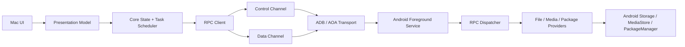

# Architecture

## Principles

- Separate product UI from transport and protocol.
- Keep control-plane requests responsive while data-plane transfers run.
- Treat Android permissions as dynamic state, not setup-time assumptions.
- Make every connection failure diagnosable.
- Keep legacy compatibility isolated behind adapters.

## Repository

```text
DroidMatch/
├── mac/
├── android/
├── proto/
├── docs/
├── tools/
├── fixtures/
└── .github/workflows/
```

## Mac Modules

```text
mac/
├── App/                 # SwiftUI/AppKit UI
├── Core/                # State machine, task scheduler, domain models
├── Transport/           # ADB, AOA, legacy adapter
├── Protocol/            # Protobuf, framing, errors
├── Media/               # Thumbnails, preview, range streaming
├── Diagnostics/         # Logs, support bundles, counters
└── Tests/
```

Primary interfaces:

- `DeviceDiscovery`
- `DeviceSession`
- `Transport`
- `RpcClient`
- `FileProvider`
- `MediaProvider`
- `TransferScheduler`
- `DiagnosticsCollector`

M0 interface boundaries:

- `DeviceDiscovery` owns device visibility events and transport candidates.
- `DeviceSession` owns connection state, selected transport, negotiated capabilities, and reconnect policy.
- `Transport` owns byte movement, state transitions, teardown, and transport-level counters.
- `RpcClient` owns request IDs, response matching, protocol errors, and control/data-plane routing.
- `FileProvider` and `MediaProvider` expose domain operations only; they do not know whether ADB, AOA, or a legacy adapter is carrying bytes.
- `TransferScheduler` owns queueing, pause/cancel/retry/resume decisions, transfer metadata, and the optional durable queue manifest.
- `DroidMatchPresentation` owns MainActor observation and privacy-bounded native view state; it never parses protocol messages, performs file I/O, or invents transfer/wire behavior.
- `DiagnosticsCollector` owns Mac-side support bundles and merges transport, protocol, permission, and transfer data.
- All product and CLI transport APIs are async and cancellation-aware. The former synchronous adapter has been deleted; App/MainActor and evidence code enter through `AsyncFramedTcpSession` or a higher async abstraction.
- `AsyncTimeoutPolicy` is the single floating-point timeout conversion boundary for async transport, RPC deadlines, and subprocess waits. It rejects non-positive/NaN/infinite values before side effects and saturates huge finite durations before integer or `DispatchTime` conversion; the harness validates the same contract before constructing Core clients.
- `AdbDeviceDiscovery` is the concrete product `DeviceDiscovery` and ADB-forward lease boundary. It executes bounded blocking ADB commands on a private queue, maps invalid configured timeouts to stable failure before process launch, retains serials only in a Core actor, emits process-local opaque UUIDs, creates dynamic loopback forwards by opaque device ID, and removes the exact owned forward on cancellation/failure/disconnect. Its UI-only marketing-name resolver receives model/device/product but never the serial. Concrete reviewed aliases live in a versioned JSON resource sealed into the App, not in Swift control flow. The assembled App reads only that main-bundle resource and never falls through to SwiftPM’s generated absolute build-tree path; a missing or damaged resource therefore fails closed. Its generic loader bounds the file before reading, requires the exact schema, validates every normalized identity, display string, locale tag, and credential-free HTTPS source, and rejects the whole table if any record is invalid. The catalog rejects duplicate matches and selects only manufacturer-published aliases through the Mac preferred-language order with exact-tag, region, script, then base-language fallback; the canonical name alone is cached. The known 704SH resolves offline to its Japanese canonical name. Other devices stream Google's fixed public full-device catalog through an ephemeral no-cookie/no-redirect session under strict byte/encoding/CSV limits. A dedicated catalog-loader actor builds a bounded process-local index; the resolver actor admits at most 64 pending tuples and performs only constant-size lookups/cache publication, so discovery can immediately fall back to the raw safe model. Matching/cache identity uses the complete accepted 512-scalar identifier rather than the truncating UI projection; only an unambiguous raw catalog name is projected for display. `DeviceDiscoveryModel` atomically replaces successful snapshots, marks retained data stale after failure, and rejects late refresh generations.
- App publication checks the target for a live process before any stale-transaction recovery and again immediately before the atomic install/swap. Darwin enumeration compares both `proc_pidpath`'s current vnode path and the kernel-retained `KERN_PROCARGS2` launch path, so unlink, rename, and swap cannot hide a process that started at the target; unavailable inspection fails closed. Live rename/replacement/unlink and interrupted-recovery regressions plus the M0 source contract bind both guard positions, while mac-skeleton runs the native behavior test. The narrow launch race after the second check remains covered by the App-lifetime `ProductExecutableFreshnessMonitor`: it obtains the device/inode identity of the vnode already mapped for dyld image zero through `proc_pidinfo`, rather than statting the launch path as its baseline, and periodically rechecks the published path even with no open window. Transactional App replacement, removal, or a non-regular node is an irreversible stale-runtime boundary delivered once to all three model gates: discovery cancels/invalidate-generates its current query and rejects future refresh, trusted-device state cancels/invalidates late publication and rejects future list/revoke entry, and the session uses its existing ordered disconnect while rejecting connect/pair actions. One App-owned window-activity coordinator starts shared discovery for the first active window, stops it only after the last active window leaves, and rejects all leases after invalidation. Every window removes the old hierarchy and leaves a localized Quit action, while the global refresh command independently fail-closes. The monitor never reads Keychain state, launches a replacement process, or treats revision/dirty metadata as executable identity; an OS request already inside Security.framework may unwind but cannot publish or start follow-up work. A tested M0 source contract binds these high-risk ownership and gating seams.
- `TrustedDevicesModel` owns the MainActor projection of secret-free Keychain metadata. `KeychainTrustedDeviceDataSource` calls a display-only store requirement that never requests password data: Core decodes the versioned key-free envelope for current records and validates account/label/Keychain dates for pre-envelope records. That passive query carries an `LAContext` with interaction disabled, so an item that would require authentication fails the snapshot rather than opening UI. Credential selection remains a separate explicit-connection boundary; only there may Core perform one legacy read/backfill and then load the selected key with normal system authentication policy. The model bounds visible loading without cancelling Security.framework, admits at most one list request, and accepts late recovery only while no mutation has invalidated that generation. It separately publishes whether a system request is still outstanding, so `DeviceDashboardView` can state that the check will not open a prompt, suggest reopening the App, and expose a real retry only after that request retires. Revocation first invalidates any pending list publication, retains the current row on false/error, and exposes only unavailable state; stale request retirement reopens admission without republishing pre-revoke rows, and the view maps all failures to fixed localized guidance after session teardown rather than rendering store errors or identifiers.
- `ProductDeviceSessionContracts` owns only stable product values, protocols, and concrete client conformances; `ProductDeviceSessionCoordinator` owns one forward lease plus at most one pairing or authenticated RPC client. After fresh paired proof, the coordinator retains the already-validated Core credential only until immutable `ProductTransferSchedulerAssembly` rechecks its exact fingerprint and places it in the same-generation invalidatable retry gate; the coordinator then clears its reference, avoiding a second Keychain read without exposing the key to Presentation. The assembly also derives the local-access owner, persistence store, and access-leased download/upload executors; it owns no generation, build task, live scheduler, or teardown decision. `ProductTransferPersistenceLocation` owns only the private manifest's domain-separated route and one-way legacy location migration: the new name never embeds the raw fingerprint, same-directory `RENAME_EXCL` prevents overwrite, and a current/legacy collision, symlink, or non-regular node is preserved and rejected. The actor-confined `ProductTransferSchedulerLifecycle` value atomically owns the current retry gate, published scheduler, and generation-bound single-flight build: concurrent callers share one build, the gate and scheduler become teardown-visible before activation, and cleanup can clear resources only when its build ID and object identity still match. The coordinator remains the sole validator of authentication generation and the sole caller of asynchronous cleanup. `ProductDeviceSessionResources` receives only an atomically detached generation and preserves the audited build-cancel → gate-invalidate → keepalive-cancel → scheduler-suspend → clients-close → forward-release order without retaining or mutating live coordinator state; it also owns the invalidatable transfer-client gate captured by retry coordinators. A Hello-only fresh connection supplies an untrusted identity selector; exact Keychain metadata chooses the pairing ID/key, and a second fresh connection must prove that key before capabilities are accepted. First pairing instead uses the visible SAS approval flow. A 10-second heartbeat owns product-session liveness: timeout, transport/remote failure, or echo mismatch first detaches the current generation, releases it in that order, then a session-scoped buffered event maps only the current Presentation generation to stable `connectionUnavailable`. Explicit disconnect/replacement cleanly finishes the old observer. Generation checks and deterministic teardown reject stale actor re-entry and keep sockets, ports, serials, credentials, and raw errors below `DeviceSessionModel`.
- `ProductDisplayText` owns the bounded NFC/whitespace/control-format-safe projection for platform- and peer-controlled labels. Its default 120-scalar cap (240 for remote entries) reserves an in-bound ellipsis when visible input is truncated. Discovery, trust, session, diagnostics, and directory Presentation consume it while retaining separate anonymous IDs, pairing records, and logical paths for actions. `DeviceSessionModel` converts Core pairing data into a minimal `DevicePairingPresentation` containing only a safe Android label and six-digit SAS; the identity fingerprint stays below Presentation.
- `ProductDeviceDiagnosticsCodec` is the only product mapping for Android device-info/diagnostics. It omits device ID and raw event/error strings, accepts only three named permission fields and a fixed counter allowlist, normalizes service state, validates numeric ranges, and strips control characters from bounded optional display metadata. The schema-v1 support-report encoder reuses the same normalization boundary so even a separately constructed public snapshot cannot export unbounded/control-bearing text, invalid device-health values, or negative counters. `DeviceDiagnosticsModel` owns refresh/stale state; SwiftUI never renders diagnostics protobufs or arbitrary key/value pairs.
- Swift actors are re-entrant at suspension points. Each async TCP connection therefore selects one I/O mode for its lifetime: legacy FIFO round trips, or multiplexed I/O owned by one RPC router. Multiplexed mode serializes writes but has exactly one independent reader that routes response/error frames by request ID and transfer frames by request/stream ID; competing readers and mode mixing are rejected.
- Multiplexed cancellation is classified at send admission. Cancellation before admission removes only that local waiter. After admission, mutation and transfer-control cancellation closes the session because the remote side effect may have occurred; cancellation of read-only heartbeat, device-info, listing, diagnostics, or thumbnail work is caller-local, while the router retains the pending request and validates/drains its response under the original deadline. A malformed or mismatched late response is still session-fatal.
- Download stream parsing and checksum/offset/window validation produce an immutable value in `AsyncRpcTransferValidation`; only the multiplexer actor applies that value to route state, yields it to the bounded consumer queue, and updates the route table. That actor-isolated inbound application is grouped in `AsyncRpcMultiplexerInboundRouting.swift` without copying state or owning another reader/socket. The pure helper owns no task, waiter, socket, or queue mutation.
- Product async uploads use a deterministic bounded-window operation: validate the full batch, emit at most 4 chunks / 2 MiB in offset order, then correlate ordered ACKs. Protocol cancellation is transfer-local after remote confirmation; direct task cancellation after a side-effecting transfer frame is admitted closes the ambiguous connection.
- `AsyncUploadFileSender` is the single file-to-window pump shared by recovery coordination and the isolated mixed-direction smoke. `AsyncMixedTransferSmokeClient` opens both directions, requires heartbeat while download is still unacknowledged and upload has sent no chunk, then runs atomic receive and upload refill concurrently. It owns the evidence session through teardown and uses an opaque inactive-side upload source label so local paths never become remote diagnostics.
- Product async downloads keep file ownership below the scheduler/UI boundary: a transfer handle serializes chunk → partial write → ACK, performs blocking file calls on a private serial queue, and atomically replaces the destination only after final ACK. The scheduler owns sidecar/retry policy and must open with the inspected partial offset plus source fingerprint; the receiver validates the accepted offset again before writing.
- The product queue is an actor above the download/upload coordinators: it owns FIFO admission, a default two-job concurrency cap, observable lifecycle snapshots, completion waiting, cancellation, and checkpoint pause/resume. Snapshot progress is a monotonic absolute receiver-confirmed checkpoint (download write + ACK; upload ACK + resumable sidecar commit), never a count of merely emitted bytes. Queued pause is a hold; running pause is allowed only after a durable checkpoint and before completion for downloads and resume-capable app-sandbox/SAF uploads. It cancels that coordinator's exclusive session, preserves the partial/sidecar, and requeues the same logical job at the FIFO tail with an explicit resume request; it is not the download-only wire pause message. A local two-second time-weighted estimator uses monotonic uptime, resets per retry/pause, publishes nil when a running sample expires, and freezes any still-valid sample on terminal transition; it does not enable protocol progress events. `canRemove` stays false while a cancelled task is still unwinding. The ordinary initializer is process-local; an explicit `TransferQueuePersistenceStore` plus `restoring(...)` enables a versioned atomic manifest. Executor start is write-ahead gated. Restoration promotes an active download or resume-capable app-sandbox/SAF upload to paused only when the durable artifact structure and persisted paths are valid, the total is known and non-conflicting, and `0 <= offset < total`; `offset == total`, `0 / 0`, unknown/conflicting totals, stale structure, and fresh-only MediaStore work become persistent `interrupted` state. Upload-v2 restoration checks the stored identity shape but cannot compare the live source before AppSupport grants its bookmark lease; after lease acquisition, the coordinator takes and matches the exact source snapshot before invoking the client factory. Manifest paths are private local recovery state, published through the fixed `0600` `.pending` recovery transaction with required file and directory synchronization and without exposing a permissive pre-chmod file; paths are omitted from public errors. The product App owns the per-device storage URL and reacquires sandbox access through AppSupport bookmarks; other callers must supply those platform boundaries explicitly.
- Resumable upload creation has a second write-ahead boundary: the coordinator
  writes its v2 sidecar and the scheduler persists the exact destination/transfer/
  size cleanup tuple before the first authenticated client is created. Permanent
  cancellation and failed-history removal enter a durable `cleaning` state;
  `AsyncTransferSchedulerUploadCleanup` runs idempotent authenticated cleanup,
  settles cancellation or removes history only after success, and prioritizes
  restored cleanup ahead of ordinary work. Session suspension retains resume
  state, while shutdown records cleanup for the next authenticated session and
  starts no new executor. AppSupport observes deferred disappearance before
  pruning the source bookmark.
- Product persistent restoration is two-phase: the scheduler reconstructs and canonicalizes its manifest behind an execution latch honored by every admission path, then exposes only the non-terminal local endpoint set to the platform access boundary. The coordinator activates queued work only after the bookmark provider reports both healthy durable state and complete coverage for the authenticated owner. Session suspension is an idempotent, irreversible invalidation boundary for that scheduler: late pause/resume/cancel/remove/retry/activate calls are rejected, repeated suspension or shutdown performs no second write, its authoritative endpoint projection closes, and it cannot overwrite a replacement scheduler's manifest. A corrupt, empty, incomplete, or wrong-owner archive therefore keeps rows visible as `writeFailed` without starting an executor.
- `TransferQueueModel` explicitly starts/stops a buffering-newest full-snapshot subscription on MainActor, preserves scheduler order and the last stopped value, rejects stale generations after restart, and forwards actions without optimistic state. A per-job pending-action set rejects duplicate UI mutations while an authoritative result is outstanding. A separate model-wide submission lease serializes single and batch download/upload admission across file and media surfaces; a concurrent call returns before data-source side effects, while already admitted transfer execution remains scheduler-owned and concurrent. The App disables the complete file/media interaction surface during that lease—including search, selection, row/context actions, navigation, and section switching—and a late batch result subtracts only its accepted request indices from current selection. The model also makes unhealthy/retrying persistence, submission, and bulk history cleanup mutually exclusive; file/media transfer affordances fail before opening native panels and show a local recovery action, while browsing and remote mutations remain independent. Queue pause/resume/cancel/remove and completed-history cleanup additionally require the first authoritative persistence read and remain closed while storage is failed or being repaired; the transfer header renders unknown/retrying state as pending rather than healthy, and a race rejected after button admission produces only fixed localized guidance. Bulk cleanup snapshots only `completed && canRemove` rows in queue order and independently removes them through the existing data-source boundary; failed, cancelled, interrupted, pending-action, and still-unwinding rows remain visible, and partial removal reports exact counts. Its immutable row items expose only a bounded `ProductDisplayText` projection of the local basename and at most a coarse allowlisted failure category—never a Mac absolute path, remote logical path, or Core's raw failure description. The same safe basename feeds opt-in system notifications; queue actions remain UUID-addressed. Exact Core labels map to typed reason codes; unknown or extended labels map to nil, while the App supplies only fixed localized guidance for retrying/failed/interrupted state. Native picker and Finder drop uploads first cross the same AppSupport selection policy: an ordered batch contains 1–100 non-symlink regular files, names are unique after canonical/case/width folding, and every filename produces the documented provider destination; this is early UX admission, not file ownership. Multi-download preflight rejects normalized duplicate names and existing local targets before any submission. The authenticated product session owns a scheduler whose private Application Support manifest is isolated by a domain-separated routing digest derived from the authenticated device fingerprint; the digest is pseudonymous routing state, not an encryption key or secrecy claim. After authenticated proof, Core separately derives a domain-separated opaque local-access owner whose storage key is available only through an AppSupport SPI and whose normal/debug/reflection descriptions are redacted; it never enters snapshots, UI, diagnostics, or logs. `DroidMatchAppSupport` stores v2 bookmark records by owner plus endpoint, commits authority before submission, reacquires/refreshes it before local file I/O, balances access with a lease, and prunes only that owner's records no longer referenced by its queue. Each accepted upload or selected-download item crosses that registration/persistence boundary independently, so zero/partial admission is disclosed and never presented as transaction rollback. Download batch results expose only accepted request indices plus job IDs—not paths—allowing the App to keep only unaccepted files selected while accepted work stays in Transfers. One process-wide FIFO consistency gate spans every owner data source and the coordinator's complete held restore transaction, while transfer I/O remains scheduler-owned and concurrent. A v1 path-only archive is preserved without attribution as legacy-unscoped authority: it may be used only as fallback when the current owner has no scoped record, is never guessed into an owner bucket, and is not pruned in this phase. Core sees only a platform-neutral owner-bound access provider. App-sandbox/SAF jobs use one recovery retry, while fresh-only MediaStore creation disables replay. Disconnect pauses recoverable work and retains unsafe work as non-replayable `interrupted`. Slot C archives sandbox-entitled authentication, browsing, bidirectional transfer, and forced-relaunch upload recovery; Developer ID signing/notarization is explicitly deferred until requested, and broader device/provider evidence remains separate release work.
- Delayed native file panels cross `ProductFileBrowserTransferPolicy` before any bookmark or scheduler effect. The pure AppSupport boundary compares the captured query and every selected row with the current loaded snapshot, rejects permission/persistence loss and duplicate current paths, distinguishes a listed child from the current writable root, and plans single/batch downloads only for a local file URL with no canonical/case/width duplicate or existing target. `DirectoryBrowserSelectionState` is a separate pure Presentation value: it owns only selection mode and logical paths, projects selected entries in the model's current row order, intersects them with each visible snapshot, gates select-all/download/delete by live item capabilities, and removes only accepted batch paths. It owns no client, task, panel, model, queue, or transfer policy. Stateless list/grid rendering remains in the App target and cannot own browser or queue state.
- Transfer scheduling keeps its immutable public job contract and executor wiring in `AsyncTransferSchedulerTypes.swift`; stateless executor dispatch and retry/progress/terminal ordering live in `AsyncTransferSchedulerJobRunner.swift`; pure retry/progress/rate-generation record transitions live in `AsyncTransferSchedulerExecutionPolicy.swift`; pure shutdown/suspension record and queue decisions live in `AsyncTransferSchedulerSessionEndPolicy.swift`; pure pause/resume/cancel record and FIFO mutations live in `AsyncTransferSchedulerControlPolicy.swift`; and pure executor-unwind reconciliation lives in `AsyncTransferSchedulerCompletionPolicy.swift`. The control policy returns an ordered settle/start/rate-expiry/executor effect list that the actor applies only after persistence succeeds, while its rollback value restores the exact pre-write record and queue. The execution policy returns either fail-stop or an exact pre-write retry rollback value, accepts only monotonic stable-total progress, and expires only the supplied current running rate generation. The completion policy mutates only one supplied record and returns an explicit paused/interrupted/terminal resolution. Actor-confined terminal outcomes, completion waiters, and snapshot observers live in `AsyncTransferSchedulerConsumerState.swift`; `AsyncTransferSchedulerRateExpiryState.swift` owns only rate-timer replacement/cancellation; and `AsyncTransferSchedulerPersistenceState.swift` owns synchronous store I/O, coarse health, and the reload latch without retaining live records. No pure policy owns a task, timer, continuation, store, socket, or broadcast. The scheduler actor still exclusively owns live tasks/records/queue, the accepted generation input, application of a fully canonicalized restored result, runtime effects, broadcast, and executor-unwind waiting; neither actor-confined helper can publish partial recovery or mutate a job independently. RPC callback-to-async one-shot state is isolated in `AsyncRpcOneShot.swift`: the first wait atomically claims the sole consumer before cancellation/continuation setup, a second wait returns a typed internal state error rather than replacing the active continuation or trapping, and a defensive missing-result branch also throws instead of terminating the process. These extractions reduce ownership mixing but do not close the remaining monoliths listed in [Structural Debt Baseline](technical-debt.md).
- `DirectoryListingQuery`/`DirectoryListingPage` form the protobuf-free product listing boundary. `AsyncRpcControlClient` sends the exact opaque token and query tuple, maps embedded provider errors to stable categories, accepts provider-unknown size/time as nil, and rejects invalid kinds, duplicate row paths, non-`dm://` identities, and an immediately repeated next token. `DirectoryListingEntry` canonicalizes optional provider MIME through `ProductMimeType`: only restricted lowercase ASCII values of at most 127 bytes and the two product-owned virtual labels survive; malformed metadata becomes nil and never grants capability, authorizes an operation, or suppresses the otherwise valid row. `DirectoryBrowserPresentationTypes` owns stable UI values, independent `canBrowse`/`canAcceptUpload` projections, and the bidi/control-safe display name without changing raw identity; `DirectoryBrowserPolicy` owns pure direct-child/mutation/media/error decisions without a client, task, generation, token, cache, or published state. `DirectoryBrowserModel` remains the sole MainActor owner of published state, listing generations, navigation, pagination, derivative Tasks/previews/permission decisions, and path-gated mutation outcomes, while `DirectoryBrowserMutationRunner` uniquely owns the active remote-mutation Task and operation identity without presentation or refresh policy. `DirectoryBrowserThumbnailState` is a pure value that owns thumbnail generation/FIFO/active-key/failure/cache transitions but no client, Task, permission decision, or Published value. The model refuses unreadable-container navigation before issuing a request, allows one listing request at a time, clears rows on valid path navigation, atomically replaces rows only after a successful refresh, preserves rows/token after load-more failure, and filters offset-pagination boundary duplicates. Navigation cancels the old listing and clears queued old-generation row thumbnails, but it does not cancel an admitted mutation; mutation completion is path-gated and refreshes the current query when the user changed search/sort within that same path. Each browser's background 96-pixel thumbnails use a strict FIFO with at most four active requests plus a cache bounded by both 64 entries and 8 MiB; hiding a browser invalidates queued derivative publication and releases its cache/preview while preserving listing/navigation state. The user-driven 512-pixel preview is outside that queue and may be a fifth control request. Active old-generation thumbnails remain counted until their requests validate/drain and release their slot, but cannot publish stale results. Listing pagination preserves preview/thumbnail completion, so load-more cannot strand an open preview in a loading state. `MediaLibraryModel` reads the authenticated live root catalog and keeps separate image/album/video browser owners. The product Files surface filters Images, Image Albums, and Videos from its root projection; Media is the sole product UI that consumes those roots, so permission revalidation and fresh-only disclosure cannot be bypassed through generic file navigation. Explicit access refresh invalidates every loaded browser before catalog validation, then reloads each prior query even when `canRead` remains true, covering Android 14 selected-media scope changes; a child permission failure blocks only its captured section until explicit refresh/activation, avoiding cross-section invalidation and roots/list retry loops. It never probes a root already reported unreadable. A write-only root can still accept a direct product upload. Names are display data but never copied into failure state or logs. `DeviceSessionModel` constructs both the Files root browser and Media library only after it receives the authenticated client, and clears both at the session boundary.
- Mutation presentation keeps operation context separate from coarse remote failure categories. Synchronous create/rename admission rejection is consumed by the still-visible edit sheet; only admitted asynchronous failure reaches the browser alert. Both surfaces use fixed localized guidance without item names, logical paths, or raw exceptions. 中文：mutation 展示将操作上下文与粗粒度远端失败类别分离；同步创建/重命名准入拒绝由仍可见的编辑 sheet 消费，只有已准入后的异步失败进入浏览器告警，两处均只使用不含条目名、逻辑路径或原始异常的固定文案。
- Local transfer-file ownership is explicit across scheduler lifetimes. Each
  download reserves the final, partial, sidecar, sidecar `.pending`/`.removing`,
  fixed `.droidmatch-commit`, and fixed `.droidmatch-replaced` entries as one
  lexical namespace; any intersection admits only one non-terminal job, and
  restoration interrupts every conflicting row. Product execution additionally
  holds an in-process reservation keyed by parent device/inode and volume case
  semantics plus sorted cross-process advisory locks for that entry set,
  together with the security-scope lease and pinned directory descriptor. The
  pinned parent owns a verified `0700` lock root, a bound `0600` identity
  anchor, and persistent empty `0600` lock files whose domain-separated hashes
  do not directly contain destination names. Fixed macOS `/var`, `/tmp`, and
  `/etc` aliases
  map to `/private` before component-wise no-follow opening; other ancestor
  symlinks fail closed. Stateless `AtomicDownloadPartialFile` owns directory and
  partial opening, single-link validation, exclusive non-blocking `flock`, and
  descriptor/name inode reconciliation without retaining a descriptor or writer
  state. `AtomicDownloadWriter` retains the returned descriptors, transaction
  state, and exact destination snapshot through publication. A fresh attempt
  locks without truncating, removes the safe old sidecar, resets that same FD,
  and only then connects.

  Commit creates a fixed `0600` marker, synchronizes it and the directory, then
  uses `RENAME_EXCL` for an absent destination or validated `RENAME_SWAP` for
  an existing one. A displaced old destination moves to the fixed replaced entry
  and remains recoverable while the coordinator removes the sidecar. Only after
  that checkpoint cleanup succeeds does finalization unlink the verified old
  entry, synchronize the directory, and remove the marker. Failure or cancellation
  before finalization restores the old destination and moves the candidate back
  to partial while retaining the marker, republishes the sidecar, and removes
  the marker only after that checkpoint is durable. A failed checkpoint restore
  therefore leaves a discoverable interrupted transaction; inability to prove
  restoration returns non-retryable
  `commitUncertain`. Crash-left marker/replaced entries make restoration
  `interrupted` rather than resumable. Directory synchronization is required,
  while the protocol still makes no complete power-loss durability claim.
  Persistent hash names are pseudonymous metadata rather than encryption, and a
  malicious same-UID writer can bypass advisory coordination and race narrow
  checked filesystem operations. Upload
  attempts hold one `O_NOFOLLOW` source FD and bind v2 recovery to size,
  nanosecond mtime/ctime, filesystem, and inode; a non-zero v1 checkpoint is
  rejected before reconnect.
- Download/upload sidecars and the private queue/bookmark stores use exact
  pinned-parent, no-follow, size-bounded single-link regular-file reads plus
  fixed `.<name>.pending` and `.<name>.removing` recovery entries. Complete stat
  snapshots and parent-path rebindings are checked around publication/removal;
  `RENAME_EXCL` handles absence and `RENAME_SWAP` handles replacement. File and
  parent-directory synchronization are required, not best effort. Every used
  pinned parent owns one permanent, fixed-name, zero-byte `0600`
  `.droidmatch-private-atomic-lock`. Exact no-follow owner/type/link/mode and
  descriptor-to-name identity checks surround its exclusive `flock`, so all
  read/save/remove transactions in cooperating processes and separate same-process
  opens serialize on the same inode. Unsafe lock nodes and crash-left recovery
  entries remain discoverable and fail closed. Failure either
  proves safe rollback/removal or returns `commitUncertain` with the recovery
  scene preserved. Unexpected directories, links, FIFOs, or hard links remain
  untouched. A malicious same-UID process can still race the final full-stat-to-
  unlink interval; advisory locking is not a malicious same-UID security boundary.
  This narrows process-crash recovery but still is not a general power-loss claim.
- Pairing and authenticated-session state are separate from transport reachability and Android permissions. The cross-platform state machine and key-storage boundary are defined in [Pairing and Session Authentication Design](pairing-auth-design.md).
- Callback-to-async completion ownership is shared rather than duplicated:
  `AsyncRpcOneShot` serves RPC and Network.framework waits with one claimed
  consumer and first-resolution support, while timeout/cancellation still close
  ambiguous transport. `AsyncRpcControlClient` carries the negotiated result in
  its `ready` state so ready-without-handshake data is unrepresentable. A
  process-local persistence reload returns the existing stable I/O error instead
  of terminating the process. Scheduler admission uses typed throws, so the
  compatibility projection exhaustively handles its declared error without a
  fallback process trap; no wire or retry policy changes at this boundary.

## Android Modules

```text
android/
├── app/
├── service/
├── transport/
├── protocol/
├── providers/
├── permissions/
├── diagnostics/
└── tests/
```

Primary components:

- `ForegroundConnectionService`
- `AdbForwardTransport`
- `AoaAccessoryTransport`
- `RpcDispatcher`
- `RpcAuthenticationHandler`
- `RpcPairingHandler`
- `RpcAuthenticationPolicy`
- `RpcTransferOpenHandler`
- `RpcTransferHandler`, including authenticated exact upload-partial disposal
- `RpcTransferFrames`
- `FileProvider`
- `MediaStoreProvider`
- `PackageProvider`
- `PermissionStateProvider`
- `DiagnosticsReporter`

M0 component boundaries:

- `ForegroundConnectionService` owns service lifetime, notification visibility, and transport binding.
- `AdbForwardTransport` owns the TCP endpoint used through `adb forward`.
- `AoaAccessoryTransport` owns accessory permission, endpoint opening, and bulk I/O.
- `RpcDispatcher` owns envelope validation, session-phase ordering, capability routing, and error normalization. `RpcControlHandler` executes already-admitted heartbeat, device-info, diagnostics, listing, mutation, and thumbnail payloads without owning session or socket state. `RpcAuthenticationHandler` owns Hello and paired reconnect proof/capability decisions; `RpcPairingHandler` owns visible start/confirm/finalize approval and final-confirmation-before-persistence. Both share one `AuthenticationRateLimiter`, while `RpcAuthenticationPolicy` owns pure protocol/nonce limits, capability intersection, and pairing-payload classification; `RpcSessionState` remains the only provisional-secret copy/zeroization owner. `RpcTransferOpenHandler` owns transfer-open parsing, capability/concurrency admission, provider opening, and initial handle installation; `RpcTransferHandler` owns chunk/ACK/cancel/pause routing and session teardown while supplying the sole shared registry to the opener. `RpcTransferFrames` owns pure transfer protobuf construction, CRC, fingerprint comparison, and chunk-size negotiation; `RpcTransferStreams` owns per-stream ACK boundaries; `RpcTransferRegistry` owns session-scoped handle identity and deterministic teardown.
- `DmFileProvider` is shared by concurrent Android sessions and owns `ProviderUploadLeases`: one canonical app-sandbox, SAF, or MediaStore upload destination can have only one process-local writer from provider open through commit/abort. Collisions fail without waiting as `alreadyExists`; token-qualified release on open failure, write failure, final commit, cancel, or session teardown cannot free a replacement owner. Per-session transfer IDs and two-stream limits remain separate RPC concerns.
- `AndroidAppSandboxCatalog` keeps resumable upload bytes in a sibling private
  staging directory rather than the exposed logical root. Opaque filenames bind
  canonical logical destination, transfer ID, and expected size; a fresh attempt
  clears older regular-file identities for that destination, so sequential
  attempts cannot splice one transfer's prefix into another. An unexpected
  matching directory or symbolic-link partial is preserved and rejected. The
  sibling node must itself be a
  no-follow directory; ordinary-file and symbolic-link nodes fail closed without
  deletion or traversal. Final publication remains a same-filesystem atomic move
  into `files/droidmatch-sandbox`.
- `FileProvider`, `MediaStoreProvider`, and `PackageProvider` own Android API access and permission-aware degradation.
- `DmFileProvider` owns logical root constants, provider composition/delegation, the bounded process-local SAF logical-token cache lifetime, and process-wide upload leases. `ProviderMediaCatalog`, `ProviderSafCatalog`, and `ProviderAppSandboxCatalog` define package-private storage ports plus fail-closed empty defaults; concrete Android catalogs implement those ports rather than facade-nested interfaces. `ProviderPagePolicy` owns pagination tokens, while `ProviderPathRouter` owns logical path/target validation and opaque SAF token resolution. `ProviderDirectoryListings` assembles point-in-time root read/write capability without treating it as an authorization token. `AppSandboxPathResolver` is the single stateless filesystem boundary for lexical validation, canonical-root confinement, and existing symbolic-link-component rejection across listing, mutation, and transfer opens; `AndroidAppSandboxCatalog` owns the remaining app-private provider behavior and staging lifecycle. `AndroidMediaCatalog` owns full/selected/denied media-access resolution, exact-item visibility checks for selected access, and MediaStore resolver calls, URI/query arguments, cursor lifetime, token cache, error mapping, thumbnails, pending rows, and transfer I/O; `AndroidSafCatalog` owns persisted tree/document listing, download, mutation admission, metadata validation, and their live permission/error mapping; `AndroidSafUploadOpener` owns authorized SAF destination/partial creation, exact child lookup, ACK-loss truncation, writer handoff, and pre-handoff cleanup. `ProviderAuthorizedTransfers` revalidates catalog-supplied live authorization before each provider-backed chunk, resolves selected-media access against the exact active item, and closes denied handles, while `SafUploadWriter` repeats the exact tree check before final publication. `MediaStoreCursorReader` only scans already-open MediaStore cursors into typed pages/albums/lookups/metadata, and `SafDocumentCursorReader` does the same for six-column SAF item/metadata/child values. `SafDocumentPolicy` purely interprets document MIME/flags, stable ordering, and hidden partial names, while `SafUploadOpenPolicy` purely classifies fresh/restart/resume and validates decoded partial metadata; none of these stateless boundaries owns resolver, URI, live permission, descriptor, stream, cache, or cleanup state. Reader/writer helpers own transfer I/O state, while opaque-ID, MIME, and cleanup helpers centralize shared mechanics. None parses RPC envelopes.
- `MediaPermissionPolicy` owns pure API-level request sets, aggregate launcher state, callback/fallback, and legacy MediaStore-write decisions. `MediaPermissionController` performs only user-triggered platform requests or guarded Settings navigation. `PermissionStateProvider` recomputes live grants for launcher, diagnostics, and provider capability reporting; none of these stores platform URIs or widens wire permission enums.
- Android launcher catalog availability is live state rather than a cached setup fact. `ProductReadiness` independently classifies paired-Mac and SAF-catalog availability; `DroidMatchActivity` never converts an unreadable catalog to a zero count, while `DroidMatchScreen` exposes fixed, polite-live-region retry actions without receiving credential IDs, tree URIs, or platform exceptions. `ProductDisplayName` is the UI-only projection for Mac-supplied names used by pending approval and paired metadata, and for provider-controlled SAF names used by grant rows and release confirmation: rendered text is NFC-normalized, whitespace-collapsed, stripped of control/format/surrogate code points, capped at 120 Unicode code points with visible ellipsis truncation, and given a fixed/localized fallback. Raw authenticated text remains in transcript/storage, and pairing ID or stable SAF root identity remains the action target.
- `ProviderPagePolicy` caps one exact page at 1,000, the query-bound retrieval
  horizon at 10,000, and rejects negative/overflow/forged high token windows.
  `ProviderBoundedPageSelector` retains at most `offset + limit` candidates and
  caps App Sandbox/SAF work at 25,000 inspected rows including filtered rows;
  crossing that scan bound is a stable unsupported-capability result. MediaStore
  continues to push query work into `ContentResolver`.
- After a valid paired reconnect proof, the credential repository monotonically
  updates encrypted last-used metadata. That best-effort metadata write cannot
  grant authority or invalidate a correct proof; failure is a bounded diagnostic.
- `DiagnosticsReporter` owns Android-side logs, counters, and service state snapshots.

## Data Flow



## Diagnostics Ownership

- Transport modules emit state transitions, reconnect attempts, endpoint details, and throughput counters.
- Protocol modules emit request IDs, payload types, negotiated versions, error codes, and timeout/cancel events.
- Provider modules emit permission state, degraded capabilities, read-only paths, and Android API failures.
- Mac `DiagnosticsCollector` creates the user-exportable support bundle.
- Android `DiagnosticsReporter` supplies service state, permission state, recent provider errors, and transport counters.

## Cache Ownership

- The Mac app owns persistent caches for thumbnails, media index summaries, transfer metadata, and support bundle staging.
- The Android app owns only short-lived in-process caches for provider queries and chunk reads.
- Cache keys must include device identity, protocol major version, provider root, and permission snapshot.
- Mutations invalidate affected directory and media cache entries.
- Permission changes invalidate provider and media caches for the affected capability.
- Transport changes do not invalidate content caches unless the device identity or protocol version changes.
- v1.0 has no cloud cache and no cache shared across devices.
