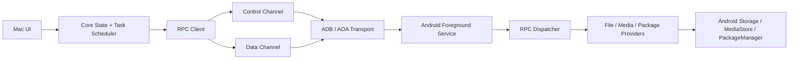

# Architecture

## Principles

- Separate product UI from transport and protocol.
- Keep control-plane requests responsive while data-plane transfers run.
- Treat Android permissions as dynamic state, not setup-time assumptions.
- Make every connection failure diagnosable.
- Keep legacy compatibility isolated behind adapters.

## Repository

```text
DroidMatch/
├── mac/
├── android/
├── proto/
├── docs/
├── tools/
├── fixtures/
└── .github/workflows/
```

## Mac Modules

```text
mac/
├── App/                 # SwiftUI/AppKit UI
├── Core/                # State machine, task scheduler, domain models
├── Transport/           # ADB, AOA, legacy adapter
├── Protocol/            # Protobuf, framing, errors
├── Media/               # Thumbnails, preview, range streaming
├── Diagnostics/         # Logs, support bundles, counters
└── Tests/
```

Primary interfaces:

- `DeviceDiscovery`
- `DeviceSession`
- `Transport`
- `RpcClient`
- `FileProvider`
- `MediaProvider`
- `TransferScheduler`
- `DiagnosticsCollector`

## Android Modules

```text
android/
├── app/
├── service/
├── transport/
├── protocol/
├── providers/
├── permissions/
├── diagnostics/
└── tests/
```

Primary components:

- `ForegroundConnectionService`
- `AdbForwardTransport`
- `AoaAccessoryTransport`
- `RpcDispatcher`
- `FileProvider`
- `MediaStoreProvider`
- `PackageProvider`
- `PermissionStateProvider`
- `DiagnosticsReporter`

## Data Flow



