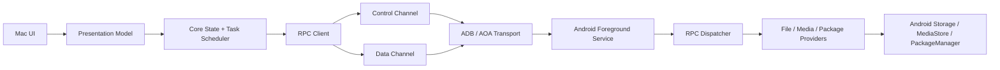

# Architecture

## Principles

- Separate product UI from transport and protocol.
- Keep control-plane requests responsive while data-plane transfers run.
- Treat Android permissions as dynamic state, not setup-time assumptions.
- Make every connection failure diagnosable.
- Keep legacy compatibility isolated behind adapters.

## Repository

```text
DroidMatch/
├── mac/
├── android/
├── proto/
├── docs/
├── tools/
├── fixtures/
└── .github/workflows/
```

## Mac Modules

```text
mac/
├── App/                 # SwiftUI/AppKit UI
├── Core/                # State machine, task scheduler, domain models
├── Transport/           # ADB, AOA, legacy adapter
├── Protocol/            # Protobuf, framing, errors
├── Media/               # Thumbnails, preview, range streaming
├── Diagnostics/         # Logs, support bundles, counters
└── Tests/
```

Primary interfaces:

- `DeviceDiscovery`
- `DeviceSession`
- `Transport`
- `RpcClient`
- `FileProvider`
- `MediaProvider`
- `TransferScheduler`
- `DiagnosticsCollector`

M0 interface boundaries:

- `DeviceDiscovery` owns device visibility events and transport candidates.
- `DeviceSession` owns connection state, selected transport, negotiated capabilities, and reconnect policy.
- `Transport` owns byte movement, state transitions, teardown, and transport-level counters.
- `RpcClient` owns request IDs, response matching, protocol errors, and control/data-plane routing.
- `FileProvider` and `MediaProvider` expose domain operations only; they do not know whether ADB, AOA, or a legacy adapter is carrying bytes.
- `TransferScheduler` owns queueing, pause/cancel/retry/resume decisions, transfer metadata, and the optional durable queue manifest.
- `DroidMatchPresentation` owns MainActor observation and privacy-bounded native view state; it never parses protocol messages, performs file I/O, or invents transfer/wire behavior.
- `DiagnosticsCollector` owns Mac-side support bundles and merges transport, protocol, permission, and transfer data.
- Product-facing transport APIs are async and cancellation-aware. Every non-transfer CLI network probe also enters through `AsyncFramedTcpSession`; only transfer evidence commands retain a synchronous adapter for compatibility with archived runs. App/MainActor code must always enter through `AsyncFramedTcpSession` or a higher async abstraction.
- `AdbDeviceDiscovery` is the concrete product `DeviceDiscovery` and ADB-forward lease boundary. It executes bounded blocking ADB commands on a private queue, retains serials only in a Core actor, emits process-local opaque UUIDs, creates dynamic loopback forwards by opaque device ID, and removes the exact owned forward on cancellation/failure/disconnect. `DeviceDiscoveryModel` atomically replaces successful snapshots, marks retained data stale after failure, and rejects late refresh generations.
- `ProductDeviceSessionCoordinator` owns one forward lease plus at most one pairing or authenticated RPC client. A Hello-only fresh connection supplies an untrusted identity selector; exact Keychain metadata chooses the pairing ID/key, and a second fresh connection must prove that key before capabilities are accepted. First pairing instead uses the visible SAS approval flow. Generation checks and deterministic teardown reject stale actor re-entry and keep sockets, ports, serials, credentials, and raw errors below `DeviceSessionModel`.
- `ProductDeviceDiagnosticsCodec` is the only product mapping for Android device-info/diagnostics. It omits device ID and raw event/error strings, accepts only three named permission fields and a fixed counter allowlist, normalizes service state, validates numeric ranges, and strips control characters from bounded optional display metadata. `DeviceDiagnosticsModel` owns refresh/stale state; SwiftUI never renders diagnostics protobufs or arbitrary key/value pairs.
- Swift actors are re-entrant at suspension points. Each async TCP connection therefore selects one I/O mode for its lifetime: legacy FIFO round trips, or multiplexed I/O owned by one RPC router. Multiplexed mode serializes writes but has exactly one independent reader that routes response/error frames by request ID and transfer frames by request/stream ID; competing readers and mode mixing are rejected.
- Product async uploads use a deterministic bounded-window operation: validate the full batch, emit at most 4 chunks / 2 MiB in offset order, then correlate ordered ACKs. Protocol cancellation is transfer-local after remote confirmation; direct task cancellation after a frame is admitted closes the ambiguous connection.
- `AsyncUploadFileSender` is the single file-to-window pump shared by recovery coordination and the isolated mixed-direction smoke. `AsyncMixedTransferSmokeClient` opens both directions, requires heartbeat while download is still unacknowledged and upload has sent no chunk, then runs atomic receive and upload refill concurrently. It owns the evidence session through teardown and uses an opaque inactive-side upload source label so local paths never become remote diagnostics.
- Product async downloads keep file ownership below the scheduler/UI boundary: a transfer handle serializes chunk → partial write → ACK, performs blocking file calls on a private serial queue, and atomically replaces the destination only after final ACK. The scheduler owns sidecar/retry policy and must open with the inspected partial offset plus source fingerprint; the receiver validates the accepted offset again before writing.
- The product queue is an actor above the download/upload coordinators: it owns FIFO admission, a default two-job concurrency cap, observable lifecycle snapshots, completion waiting, cancellation, and checkpoint pause/resume. Snapshot progress is a monotonic absolute receiver-confirmed checkpoint (download write + ACK; upload ACK + resumable sidecar commit), never a count of merely emitted bytes. Queued pause is a hold; running pause is allowed only after a durable checkpoint and before completion for downloads and resume-capable app-sandbox/SAF uploads. It cancels that coordinator's exclusive session, preserves the partial/sidecar, and requeues the same logical job at the FIFO tail with an explicit resume request; it is not the download-only wire pause message. A local two-second time-weighted estimator uses monotonic uptime, resets per retry/pause, publishes nil when a running sample expires, and freezes any still-valid sample on terminal transition; it does not enable protocol progress events. `canRemove` stays false while a cancelled task is still unwinding. The ordinary initializer is process-local; an explicit `TransferQueuePersistenceStore` plus `restoring(...)` enables a versioned atomic manifest. Executor start is write-ahead gated. Only an active download or app-sandbox/SAF upload with a matching valid sidecar becomes paused/resumable after reconstruction; stale, corrupt, missing-checkpoint, and fresh-only MediaStore work becomes persistent `interrupted` state and is never replayed automatically. Manifest paths are private local recovery state, written with 0600 permissions and omitted from public errors. The caller owns the storage URL and future sandbox access reacquisition.
- `TransferQueueModel` explicitly starts/stops a buffering-newest full-snapshot subscription on MainActor, preserves scheduler order and the last stopped value, rejects stale generations after restart, and forwards actions without optimistic state. Its immutable row items expose a local basename and only a validated optional `dm://` remote logical path, never a Mac absolute path or Core's raw failure description. It also publishes the scheduler's coarse `disabled`/`healthy`/`writeFailed` persistence status without exposing filesystem errors. The authenticated product session owns a scheduler whose private Application Support manifest is isolated by authenticated device fingerprint: readable file rows obtain a destination through `NSSavePanel`; writable directories accept one `NSOpenPanel` source through `ProductUploadDestination`. App-sandbox/SAF jobs use one recovery retry, while fresh-only MediaStore creation disables replay. Disconnect pauses recoverable work and retains unsafe work as non-replayable `interrupted`; future App Sandbox distribution still requires security-scoped bookmark reacquisition.
- Transfer scheduling keeps its immutable public job contract and synchronous-retry relay in `AsyncTransferSchedulerTypes.swift`; the scheduler actor owns queue/runtime transitions. RPC callback-to-async one-shot state is isolated in `AsyncRpcOneShot.swift`. These extractions reduce ownership mixing but do not close the remaining monoliths listed in [Structural Debt Baseline](technical-debt.md).
- `DirectoryListingQuery`/`DirectoryListingPage` form the protobuf-free product listing boundary. `AsyncRpcControlClient` sends the exact opaque token and query tuple, maps embedded provider errors to stable categories, accepts provider-unknown size/time as nil, and rejects invalid kinds, duplicate row paths, non-`dm://` identities, and an immediately repeated next token. `DirectoryBrowserModel` allows one request at a time, clears rows on path navigation, atomically replaces rows only after a successful refresh, preserves rows/token after load-more failure, filters offset-pagination boundary duplicates, and uses cancellation plus a generation guard so late results cannot replace another directory. Names are display data but never copied into failure state or logs. The SwiftUI file page is constructed only after `DeviceSessionModel` receives an authenticated client and loads `dm://roots/`.
- Pairing and authenticated-session state are separate from transport reachability and Android permissions. The cross-platform state machine and key-storage boundary are defined in [Pairing and Session Authentication Design](pairing-auth-design.md).

## Android Modules

```text
android/
├── app/
├── service/
├── transport/
├── protocol/
├── providers/
├── permissions/
├── diagnostics/
└── tests/
```

Primary components:

- `ForegroundConnectionService`
- `AdbForwardTransport`
- `AoaAccessoryTransport`
- `RpcDispatcher`
- `RpcAuthenticationHandler`
- `RpcTransferHandler`
- `FileProvider`
- `MediaStoreProvider`
- `PackageProvider`
- `PermissionStateProvider`
- `DiagnosticsReporter`

M0 component boundaries:

- `ForegroundConnectionService` owns service lifetime, notification visibility, and transport binding.
- `AdbForwardTransport` owns the TCP endpoint used through `adb forward`.
- `AoaAccessoryTransport` owns accessory permission, endpoint opening, and bulk I/O.
- `RpcDispatcher` owns envelope validation, session-phase ordering, capability routing, and error normalization. `RpcAuthenticationHandler` owns Hello/reconnect/first-pairing exchanges and rate limiting; `RpcSessionState` owns provisional secret copying and zeroization. `RpcTransferHandler` owns transfer open/chunk/ACK/cancel/pause routing plus session-scoped registries; `RpcTransferStreams` owns per-stream ACK boundaries and provider-handle lifetime.
- `FileProvider`, `MediaStoreProvider`, and `PackageProvider` own Android API access and permission-aware degradation.
- `DmFileProvider` owns logical roots, pagination tokens, the bounded process-local SAF logical-token map, and catalog dispatch. `ProviderPathRouter` owns logical path/target validation and opaque SAF token resolution. `AndroidAppSandboxCatalog` owns canonical app-private files; `AndroidMediaCatalog` owns live permission-aware MediaStore operations; `AndroidSafCatalog` owns persisted tree/document operations and transfer-ID partial resume. Reader/writer helpers own transfer I/O state, while opaque-ID, MIME, and cleanup helpers centralize shared mechanics. None parses RPC envelopes.
- `PermissionStateProvider` owns live capability reporting.
- `DiagnosticsReporter` owns Android-side logs, counters, and service state snapshots.

## Data Flow



## Diagnostics Ownership

- Transport modules emit state transitions, reconnect attempts, endpoint details, and throughput counters.
- Protocol modules emit request IDs, payload types, negotiated versions, error codes, and timeout/cancel events.
- Provider modules emit permission state, degraded capabilities, read-only paths, and Android API failures.
- Mac `DiagnosticsCollector` creates the user-exportable support bundle.
- Android `DiagnosticsReporter` supplies service state, permission state, recent provider errors, and transport counters.

## Cache Ownership

- The Mac app owns persistent caches for thumbnails, media index summaries, transfer metadata, and support bundle staging.
- The Android app owns only short-lived in-process caches for provider queries and chunk reads.
- Cache keys must include device identity, protocol major version, provider root, and permission snapshot.
- Mutations invalidate affected directory and media cache entries.
- Permission changes invalidate provider and media caches for the affected capability.
- Transport changes do not invalidate content caches unless the device identity or protocol version changes.
- v1.0 has no cloud cache and no cache shared across devices.
