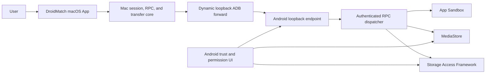
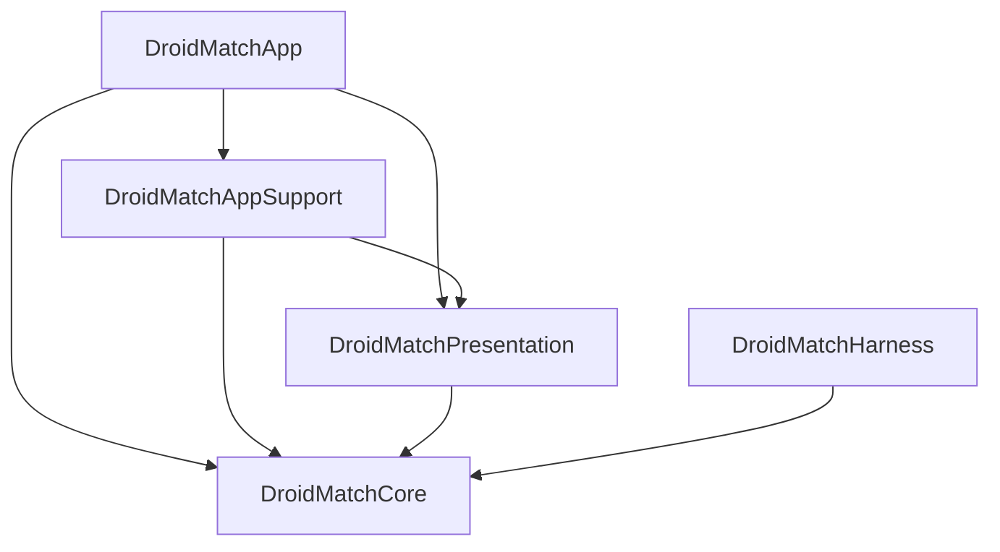
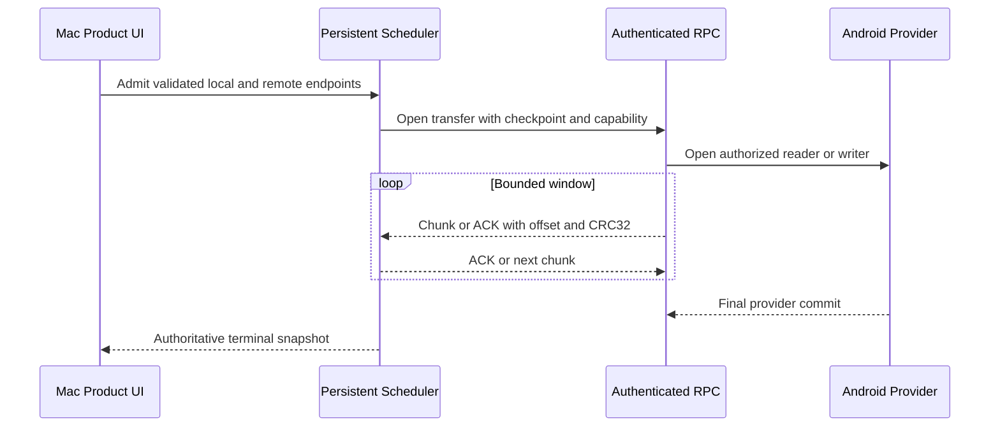

# Architecture

This document describes the current dependency direction and runtime ownership
of DroidMatch. It intentionally stays above file-by-file implementation detail;
use the [Mac code overview](mac-code-overview.md) and
[Android code overview](android-code-overview.md) for source orientation.

## Principles

- Product UI depends on domain, session, and transfer interfaces. It does not
  parse protobuf frames, execute raw ADB commands, or own retry policy.
- Transport owns byte movement and connection state. RPC owns envelopes,
  request/stream IDs, response matching, and normalized errors. Transfer owns
  checkpoints, integrity, retry/resume, and atomic destination publication.
- Android permission and provider capability are live state, not setup facts.
- Raw platform paths, `content://` URIs, credentials, and device serials stay
  below product presentation and public diagnostics.
- The CLI harness consumes reusable Core behavior; it is not a second product implementation.
- ADB and future AOA transport must expose the same semantic protocol surface.
  AOA remains experimental until its documented device gates pass.

## System context


```mermaid
flowchart LR
    User["User"] --> MacApp["DroidMatch macOS App"]
    MacApp --> Core["Mac session, RPC, and transfer core"]
    Core --> Forward["Dynamic loopback ADB forward"]
    Forward --> Endpoint["Android loopback endpoint"]
    Endpoint --> Dispatcher["Authenticated RPC dispatcher"]
    Dispatcher --> Sandbox["App Sandbox"]
    Dispatcher --> Media["MediaStore"]
    Dispatcher --> SAF["Storage Access Framework"]
    AndroidUI["Android trust and permission UI"] --> Endpoint
    AndroidUI --> Media
    AndroidUI --> SAF
```

The Android App is a secure connection, trust, media-permission, and folder-
authorization companion. The Mac App owns the full file/media browsing and
transfer-queue product experience.

## Repository layout

```text
DroidMatch/
├── mac/               # Swift package, product App, reusable Core, and harness
├── android/           # Android companion, RPC endpoint, and storage providers
├── proto/v1/          # shared protobuf wire schema
├── docs/              # current contracts, guides, and historical records
├── tools/             # build, generation, gate, and device-runner scripts
├── fixtures/          # redacted test fixtures and admitted device evidence
└── .github/workflows/ # hosted CI
```

## Mac modules

The physical Swift Package targets are:


```mermaid
flowchart TD
    App["DroidMatchApp"] --> Support["DroidMatchAppSupport"]
    App --> Presentation["DroidMatchPresentation"]
    App --> Core["DroidMatchCore"]
    Support --> Presentation
    Support --> Core
    Presentation --> Core
    Harness["DroidMatchHarness"] --> Core
```

### `DroidMatchCore`

Core owns behavior that must remain reusable outside SwiftUI:

- ADB discovery and dynamic forward leases, with serials retained below Presentation.
  The assembled sandbox product exclusively executes its sealed adb with a minimal
  HOME/TMPDIR environment on a dedicated localhost server socket; a missing or
  unusable embedded file fails closed instead of crossing into development
  SDK/HOME/PATH/default-server fallback. Non-sandbox harnesses retain those explicit
  development fallbacks.
- framed TCP, protobuf RPC, handshake, pairing, paired authentication, and deadlines.
- the single-reader asynchronous multiplexer and control/data-plane routing.
- download/upload validation, checkpoints, retry/resume, cancellation, and atomic file operations.
- the persistent transfer scheduler and privacy-bounded domain values.
- diagnostics codecs and stable error normalization.

Core does not present UI, open native file panels, or own security-scoped bookmark UX.

### `DroidMatchPresentation`

Presentation owns MainActor-observable product state:

- device discovery, trusted-device, session, diagnostics, file-browser, media-library,
  and transfer-queue models;
- generation checks that reject late async publication;
- stable anonymous action IDs and bounded display values;
- view-facing policy for capability, selection, mutation, and transfer states.

Presentation does not parse protobuf, perform platform file I/O, or receive credentials.

### `DroidMatchAppSupport`

AppSupport adapts platform facilities into Core/Presentation contracts:

- security-scoped bookmarks and per-device transfer persistence setup;
- Keychain trusted-device metadata projection;
- native file-panel admission policy;
- product window activity and executable-freshness lifecycle boundaries.

### `DroidMatchApp`

The executable target composes Core, Presentation, and AppSupport into SwiftUI/
AppKit screens, menus, native panels, notifications, local help, and localization.
It owns product composition, not protocol or transfer semantics.

### `DroidMatchHarness`

The CLI harness exposes Core operations for local and physical-device evidence.
It may format bounded results, but it must not become the only owner of product behavior.

## Android layers

Android currently uses one Gradle `app` module. Production classes live under
`android/app/src/main/java/app/droidmatch/m1/`; the following are responsibility
layers rather than separate Gradle modules.

### Product and service lifecycle

- `DroidMatchActivity` and `DroidMatchScreen` present secure connection, pairing,
  paired-Mac trust, media permission, and SAF authorization state.
- `ForegroundConnectionService` owns foreground-service lifetime and notification visibility.
- `AdbEndpoint` binds only to loopback, owns bounded socket admission, and tears
  down admitted sessions with the service.

### Protocol and authentication

- `FramedIo` enforces frame boundaries before protobuf dispatch.
- `RpcDispatcher` validates session ordering and routes already-decoded requests.
- `RpcAuthenticationHandler`, `RpcPairingHandler`, and `RpcSessionState` own
  handshake, paired proof, visible pairing, provisional secrets, and capability admission.
- `RpcControlHandler` executes admitted control requests.
- `RpcTransferOpenHandler`, `RpcTransferHandler`, `RpcTransferStreams`, and
  `RpcTransferRegistry` own transfer admission, active stream state, and teardown.

The dispatcher does not implement MediaStore, SAF, or app-private storage rules.

### Provider boundary

`DmFileProvider` composes the storage ports and the process-wide path coordinator:

- `AndroidAppSandboxCatalog` owns canonical app-private paths and resumable staging.
- `AndroidMediaCatalog` owns MediaStore queries, live selected/full/denied access,
  pending publication, thumbnails, and fresh-only upload behavior.
- `AndroidSafCatalog` and `AndroidSafUploadOpener` own persisted tree permission,
  document identity, listing/mutation, transfer opening, and ACK-loss reconciliation.
- `ProviderPathRouter`, `ProviderPagePolicy`, and related helpers own logical
  routing, bounded pagination, MIME projection, opaque IDs, and deterministic cleanup.

Every provider operation rechecks the permission and capability it needs.
Provider exceptions, platform paths, and document IDs are normalized before the wire boundary.

## Runtime flows

### Discovery and authentication

1. Mac Core runs bounded ADB discovery and publishes only anonymous device values to Presentation.
2. A selected device receives a dynamic loopback forward lease.
3. A fresh connection completes `ClientHello`/`ServerHello` before any other request.
4. First pairing requires user-visible SAS approval; reconnect must prove the stored paired key.
5. Only the authenticated session capabilities unlock product browsing and transfers.
6. Disconnect, keepalive failure, replacement, or executable invalidation tears
   down clients, schedulers, credentials, sockets, and the exact owned forward in order.

### Listing and mutation

1. Product models send only validated `dm://` logical paths and opaque page tokens.
2. RPC checks authentication and capability before calling `DmFileProvider`.
3. The provider resolves a live root and permission snapshot, performs the operation,
   and returns bounded logical metadata.
4. Mac Presentation applies the result only to the matching path/query generation.

Create, rename, and delete share provider path coordination with uploads so an
overlapping mutation cannot race an active destination owner.

### Transfer

Video playback is a read-only consumer of the same authenticated download
protocol. Core owns bounded byte ranges, stable source fingerprint/size checks,
CRC/offset validation, and stream cleanup. Presentation binds the reader to one
opaque preview context. AppSupport adapts the ranges to AVFoundation through a
random per-preview URL, with external media references and AirPlay disabled;
the App supplies native playback controls. DroidMatch writes no video cache or
preview download file, and closing or invalidating the preview stops its reader.


```mermaid
sequenceDiagram
    participant UI as Mac Product UI
    participant Queue as Persistent Scheduler
    participant RPC as Authenticated RPC
    participant Provider as Android Provider
    UI->>Queue: Admit validated local and remote endpoints
    Queue->>RPC: Open transfer with checkpoint and capability
    RPC->>Provider: Open authorized reader or writer
    loop Bounded window
        RPC-->>Queue: Chunk or ACK with offset and CRC32
        Queue-->>RPC: ACK or next chunk
    end
    Provider-->>RPC: Final provider commit
    Queue-->>UI: Authoritative terminal snapshot
```

Downloads remain partial until an atomic local commit. Resume requires the
stable Android source fingerprint to match. Upload resume reconciles provider
partial state with the last durable Mac acknowledgement. The documented limit
remains four in-flight chunks or 2 MiB per stream.

## Persistence and privacy ownership

- Mac Core owns transfer records, checkpoints, integrity state, and atomic recovery files.
- AppSupport owns sandbox bookmark acquisition and authenticated per-device storage location.
- Android providers own private resumable partials and final provider publication.
- Product diagnostics use fixed schemas and allowlists; raw serials, credentials,
  user paths, provider URIs, and arbitrary exception strings do not enter Presentation.
- Caches are optimizations only. Permission, authentication, and capability are
  revalidated at their owning boundaries rather than inferred from cached display state.

## Wire and generated code

`proto/v1/*.proto` is the shared wire source of truth. Existing fields and enum
values are never reused or renumbered. Generated Swift sources are updated only
through `bash tools/generate-swift-proto.sh`; Android Java lite sources are generated by Gradle.

See [protocol.md](protocol.md), [protocol-runtime.md](protocol-runtime.md),
[path-model.md](path-model.md), [security-model.md](security-model.md), and
[pairing-auth-design.md](pairing-auth-design.md) before changing a cross-platform boundary.
